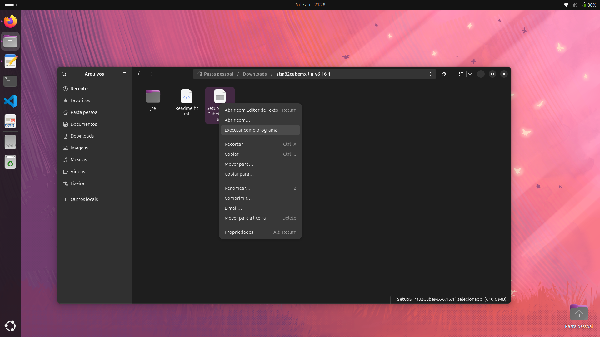
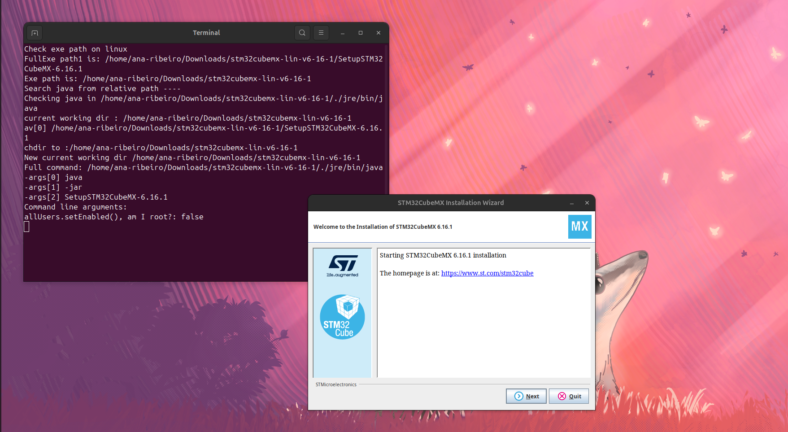

# STM32CubeMX: O Configurador Gráfico

O STM32CubeMX é o cérebro por trás da arquitetura ARM da ST. Ele é um gerador de código visual: você configura o hardware (pinos e clocks) e ele escreve os drivers complexos para você.

Existem duas formas de utilizá-lo:

1. Integrado: Já vem dentro do STM32CubeIDE (abre automaticamente ao clicar em arquivos .ioc).
2. Standalone (Avulso): Uma ferramenta separada, ideal para quem quer apenas planejar o hardware ou usar compiladores diferentes.

**⚠️ Mudança Crítica (Versão 2.0.0+):** Nas versões atuais, a ST separou o CubeMX da IDE. Embora ainda exista a versão integrada, o uso da versão Standalone tornou-se o fluxo mais estável e recomendado para evitar erros de compilação no Linux.

---

#    Download

1. Acesse o site: [STM32CubeMX Official Page.](https://www.st.com/en/development-tools/stm32cubemx.html?dl=redirect)
2. Get Software: Escolha a opção STM32CubeMX (Linux).


3. E-mail: Assim como na IDE, você receberá um link de download por e-mail após preencher os dados de convidado.


---

#  Instalação no Ubuntu

O instalador do CubeMX para Linux utiliza Java para rodar a interface gráfica. Siga os passos abaixo para garantir que o instalador abra corretamente.

## Opção 1: Via Terminal

**Passo 1. Extrair e Preparar**

Abra o terminal e prepare o ambiente:

```
cd ~/Downloads
unzip en.stm32cubemx-lin-v*.zip
```
```
# Entre na pasta extraída
cd mx_pasta_extraida
```
```
# Conceda permissão de execução (ajuste para a sua versão)
chmod +x SetupSTM32CubeMX-6.16.1.linux
```

**Passo 2. Executando o Instalador Gráfico**

Após dar a permissão, você pode executar o arquivo como um programa:
```
./SetupSTM32CubeMX-6.16.1
```

Assim que você executar este comando, a janela de instalação da ST será aberta. Basta seguir o assistente (Next/Avançar), aceitar os termos e escolher a pasta de destino.

---


## Opção 2: Via Interface Gráfica (Manual)

Se você prefere não usar o terminal, pode fazer o processo manualmente como eu fiz:

1. **Extração:** Vá até a sua pasta de Downloads, clique com o botão direito no arquivo .zip e selecione "Extrair".
2. **Execução:** Entre na pasta extraída, localize o arquivo SetupSTM32CubeMX-6.16.1, clique com o botão direito nele e vá em `Executar como um programa` .





3. **Instalação:** Após executar como um prgrama ira abrir uma janela do terminal e logo depois a janela de instalação




### Caso não apaceça a opção de executar como um prhrama faça o seguinte:

1. **Extração:** Vá até a sua pasta de Downloads, clique com o botão direito no arquivo .zip e selecione "Extrair Aqui".
2. **Permissão de Execução:** Entre na pasta extraída, localize o arquivo SetupSTM32CubeMX-6.16.1.linux, clique com o botão direito nele e vá em Propriedades.
3. **Aba Permissões:** Marque a caixa que diz "Permitir execução do arquivo como programa".
4. **Executar:** Feche a janela de propriedades e dê um duplo clique no arquivo (ou clique com o botão direito e selecione "Executar").

**Nota:** Assim que você executar (por qualquer um dos métodos), a janela de instalação oficial da ST será aberta. Basta seguir o assistente (Next/Avançar), aceitar os termos e escolher a pasta de destino.

Após a instalação o cubeMX ira aparecer na gaveta de aplicativos, essa será sua tela inicial


