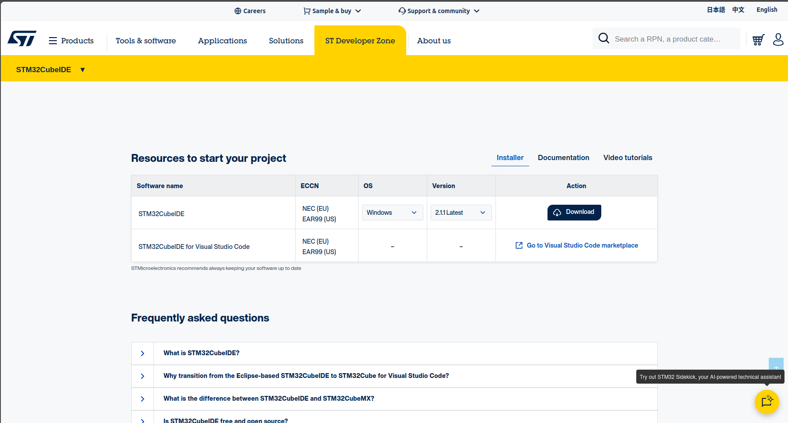
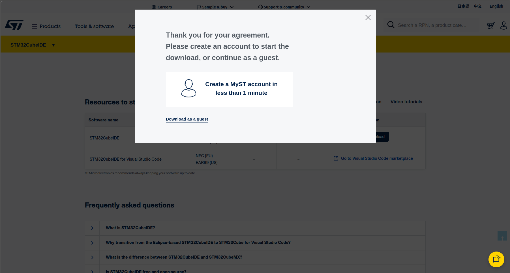
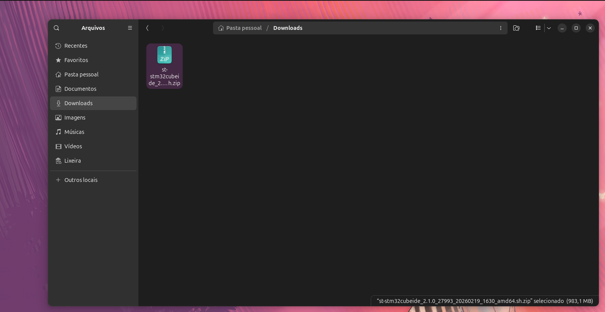
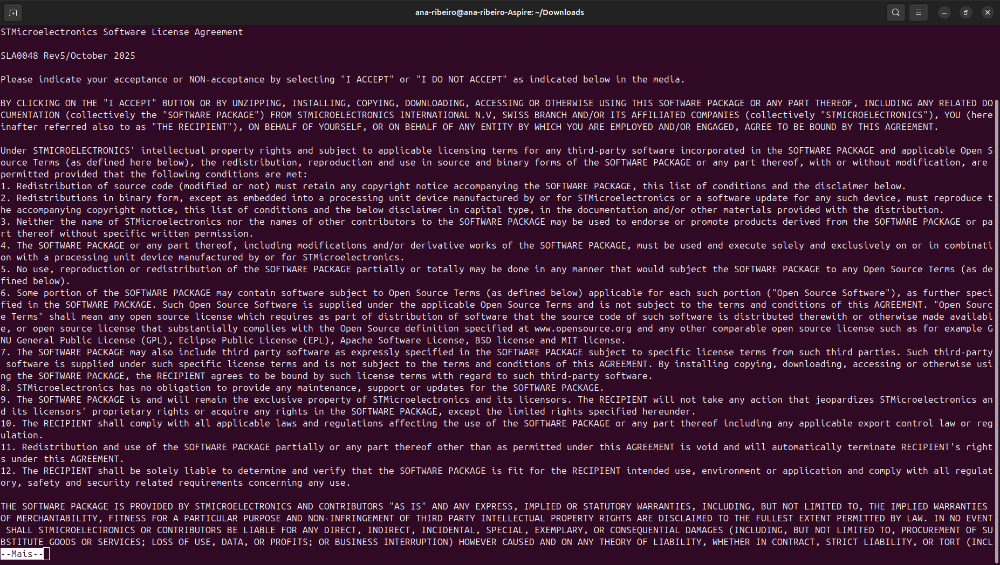
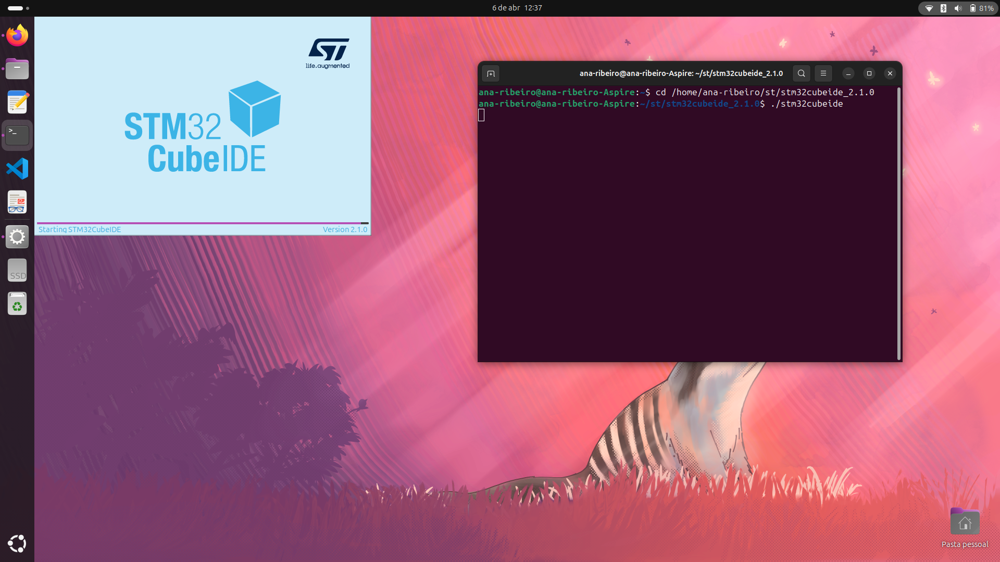

# 📥 Download e Instalação

Nesta página, vamos cobrir o processo completo para obter o STM32CubeIDE e instalá-lo corretamente no Ubuntu, garantindo que as permissões de hardware sejam configuradas logo de início.

---

# 1. Fazendo o Download

O primeiro passo é acessar a zona de desenvolvedores da ST e escolher a versão correta para o ecossistema Linux.

1. Acesse o site oficial: [STM32CUBE - IDE](https://www.st.com/content/st_com/en/stm32-mcu-developer-zone.html)
2. Selecione a ferramenta: Vá em Develop and debug e escolha a opção STM32CubeIDE.
3. Escolha a versão: Procure pelo instalador Generic Linux (`ex: Versão 11.1.0 ou superior`).
   


5. Inicie o download: Você pode fazer login ou baixar como convidado. Após preencher seus dados, um link de download será enviado para o seu e-mail.



6. Arquivo: Você receberá um arquivo .zip (`ex: en.st-stm32cubeide_1.x.x_xxxx_x86_64.sh.zip`) na sua pasta de Downloads.



---

# 2. Instalação via Terminal

Com o arquivo baixado, vamos utilizar o terminal para descompactar e executar o instalador.

**Passo 1:** Navegue até a pasta 
```
cd ~/Downloads
```

**Passo 2:** Descompacte o arquivo

Lembre-se de ajustar o nome do arquivo para a versão exata que você baixou:
```
unzip st-stm32cubeide_2.1.0_27993_20260219_1630_amd64.sh.zip
```

**Passo 3:** Conceda permissão de execução
```
chmod +x st-stm32cubeide_2.1.0_27993_20260219_1630_amd64.sh
```

**Passo 4:** Execute o instalador
```
./st-stm32cubeide_2.1.0_27993_20260219_1630_amd64.sh
```

***💡 Durante a Instalação:*** > * Aceite o contrato de licença.

- Escolha o diretório de instalação (`Ex: /home/ana-ribeiro/st/stm32cubeide_2.1.0`).

- **Importante:** Quando o instalador perguntar: "Do you want to install Segger J-Link udev rules? [Y/n]", digite Y. Isso configura as permissões necessárias para que seu computador acesse o hardware (gravador) via USB sem erros de permissão.



---

# 3. Executando e Criando Atalho

Após concluir a instalação, você tem duas formas principais de abrir o IDE.

**Opção 1:** Execução Direta

Você pode navegar até a pasta e rodar o binário:

```
cd /home/ana-ribeiro/st/stm32cubeide_2.1.0
./stm32cubeide
```


---

**Opção 2**: Menu de Aplicativos (Interface Gráfica)

Se você aceitou todas as opções durante a instalação via terminal, o Ubuntu automaticamente registrará o STM32CubeIDE na sua lista de programas.

- Pressione a tecla Super (a tecla com o logo do Windows) no seu teclado.
- Digite "STM32" na barra de pesquisa.
- O ícone azul da IDE deve aparecer. Você pode clicar com o botão direito e selecionar "Adicionar aos Favoritos" para que ele fique sempre visível na sua barra lateral (Dock).

    ⚠️ Nota para Usuários de Ubuntu Moderno:
    Se o ícone não aparecer imediatamente, tente reiniciar sua sessão (Log out e Log in). O sistema às vezes precisa desse "refresh" para indexar o novo atalho criado pelo instalador.

